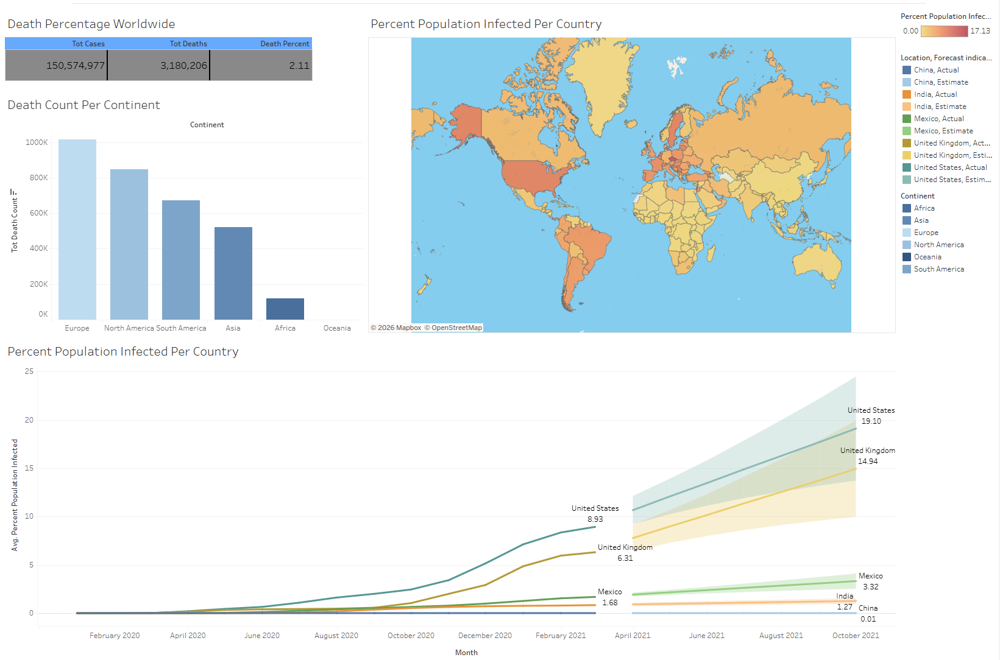

# Data Analytics Portfolio Projects

A collection of data analytics projects demonstrating SQL, Python, data cleaning,
exploratory data analysis, and data visualization.

---

## COVID-19 Exploratory Data Analysis & Dashboard

Analyzed global COVID-19 cases, deaths, and vaccination trends using SQL and
visualized key findings in Tableau.

**Skills:** SQL, Joins, CTEs, Window Functions, Temp Tables, Views, Tableau

- Analyzed COVID-19 infection, mortality, and vaccination trends across
  countries and time periods.
- Used joins, CTEs, window functions, temp tables, and views to calculate
  rolling vaccinations and population-level metrics.
- Built an interactive Tableau dashboard to visualize geographic and
  temporal trends.

### Tableau Dashboard

[View Interactive Tableau Dashboard](https://public.tableau.com/app/profile/meghna.dinesh2904/viz/CovidDashboard_17694753916040/Dashboard1)

[View SQL Analysis](Covid%20Portfolio%20Project.sql)

---

## Movie Revenue Data Analysis

Performed exploratory data analysis on movie data using Python to investigate
revenue trends and relationships between movie attributes.

**Skills:** Python, Pandas, NumPy, Matplotlib, Seaborn, Data Cleaning,
Exploratory Data Analysis, Correlation Analysis

- Cleaned and transformed movie data by handling missing values, correcting
  data types, and standardizing year information.
- Analyzed relationships between budget, gross revenue, ratings, votes,
  runtime, and other numeric features using Pearson, Kendall, and Spearman
  correlations.
- Analyzed revenue by production company and year to identify top-performing
  companies and company-year combinations.
- Visualized revenue distributions and relationships using correlation
  heatmaps, regression plots, scatter plots, box plots, and strip plots.

[View Python Analysis](Movies%20Portfolio%20Project.ipynb)

---

## Nashville Housing Data Cleaning

Cleaned and transformed housing data using SQL to improve data quality and
prepare the dataset for downstream analysis.

**Skills:** SQL, Data Cleaning, Self Joins, CTEs, Window Functions,
String Manipulation

- Standardized sale date formats and populated missing property addresses
  using a self join based on parcel IDs.
- Split property and owner addresses into separate address, city, and state
  fields using SQL string functions.
- Standardized inconsistent categorical values in the `SoldAsVacant` field.
- Identified and removed duplicate records using a CTE and `ROW_NUMBER()`.
- Removed redundant columns after completing the data-cleaning process.

[View SQL Project](Nashville%20Housing%20Portfolio%20Project.sql)
